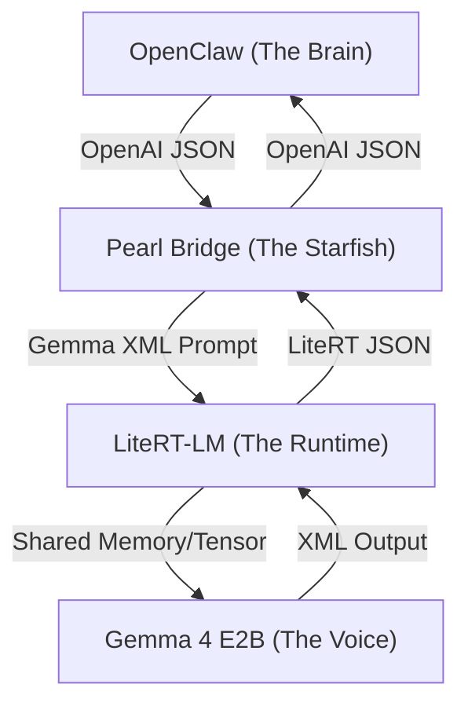

# Starfish Protocol: Specification & Internals

OpenClaw Pearl acts as a **"Starfish"**—a resilient, multi-armed intermediary that enables agentic tool-calling on local edge hardware. Like a starfish, each "arm" (track) can regenerate and function independently while staying connected to the core. This document specifies the protocol contract between all layers of the stack and outlines the future roadmap.

---

## 🏗️ Architecture Overview: The 4-Layer Cake

The stack is composed of four distinct layers, each with a strict responsibility boundary.



| Layer | Responsibility | Communication Protocol |
| :--- | :--- | :--- |
| **OpenClaw** | Agent loop, tool execution, permissions. | OpenAI Chat Completions (REST/JSON) |
| **Pearl Bridge** | Translation, Stealth (Regex), Provider Adaption. | HTTP/SSE (Internal Bridge) |
| **LiteRT-LM** | Model loading, tokenization, inference management. | LiteRT Responses API (REST/JSON) |
| **Gemma 4 E2B** | Reasoning, tool intent generation. | Prompt Tokens (XML) |

---

## 📑 Protocol Contract

### 1. Request Mapping (Outbound)
When OpenClaw sends a tool-calling request, the Bridge transforms it from OpenAI's `tools` schema into a natural language prompt that Gemma understands.

**OpenAI Input:**
```json
{
  "tools": [{ "function": { "name": "read_file", "parameters": { ... } } }]
}
```

**Gemma Prompt Injection (`GemmaFormatter.kt`):**
```text
<start_of_turn>user
You have access to the following tools:
- read_file: Read a file from the workspace
  Parameters: {"type":"object", ...}

To use a tool, respond with a JSON object inside <tool_call> tags.
<end_of_turn>
```

### 2. Response Mapping (Inbound)
Gemma produces an XML block. The Bridge must intercept this before OpenClaw sees it to prevent "XML leakage" and ensure the agent loop continues.

**Gemma Output:**
```text
I will read the file now.
<tool_call>{"tool_name": "read_file", "parameters": {"path": "README.md"}}</tool_call>
```

**Bridge Transformation (`LiteRTPearlRunner.kt`):**
1. **Extraction**: Uses `Regex("<tool_call>([\\s\\S]*?)</tool_call>")` to parse the JSON.
2. **Stealth**: Strips the `<tool_call>` block from the text using `.replace(regex, "")`.
3. **OpenAI Output**: Returns a standard OpenAI `tool_calls` array.

---

## 🛠️ Configuration & Stealth Rules

### The "Stealth" Rule
The Bridge must **never** return raw XML to OpenClaw. If the Bridge returns `<tool_call>` tags in the `content` field, OpenClaw's parser may fail or the user may see internal protocol details. The Bridge effectively "shadows" the model's native intent.

### Gemma 4 E2B Setup
To function as the "Voice", Gemma must be loaded with a specific system instruction that enforces JSON-in-XML tool calling. This is currently injected by the `GemmaFormatter` in the `user` turn to ensure it stays within the model's attention window.

---

## 🚀 Future Roadmap: Phase 2 & 3

### Option B: The "High-Performance Starfish" (Binary)
Currently, the "double-hop" (JSON -> Prompt -> Inference -> XML -> JSON) adds latency.
- **Goal**: Implement a binary bridge using Protobuf or FlatBuffers between the Kotlin Bridge and LiteRT-LM.
- **Benefit**: Reduces serialization overhead by ~15-20% for local inference.

### Option C: The "Native E2B" Sandbox (Local Execution)
Currently, OpenClaw executes tools. However, for "Gemma 4 E2B" (Edge-to-Base/Execute-to-Base), some tools (like Python code interpretation) are better run near the model.
- **Goal**: The Bridge intercepts `code_interpreter` tool calls.
- **Execution**: Runs the code in a local Docker/WebAssembly sandbox.
- **Flow**: Only returns the *result* to OpenClaw, significantly reducing the round-trip time for complex data analysis.

---

> [!IMPORTANT]
> **Safety Protocol**: Even in a "Native E2B" future, the Bridge must strictly follow OpenClaw's `AGENTIC_REGISTRY.md` to ensure it never executes unauthorized shell commands or bypasses user approval gates.
